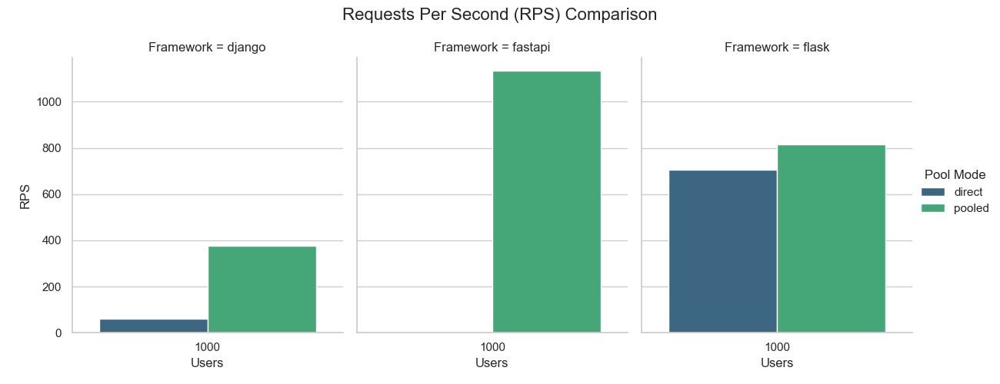
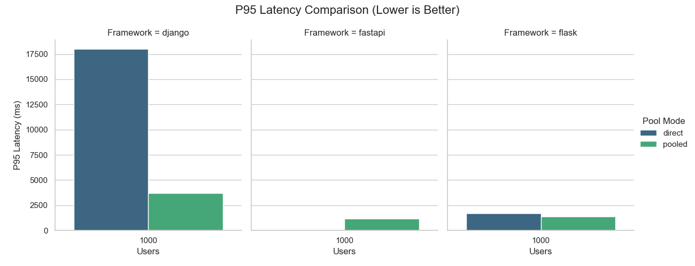

# Python 웹 프레임워크 & PgBouncer 벤치마크

FastAPI, Django, Flask와 PostgreSQL 간의 상호작용 시 PgBouncer 도입 전후 성능 차이를 분석하는 벤치마크입니다.

---

## 아키텍처

### 1. 시스템 구성도
```text
                  [Client: Locust Load Generator]
                                |
                         (HTTP Requests)
                                |
                                v
      +---------------------------------------------------+
      |  Application Layer (FastAPI / Django / Flask)     |
      +---------------------------------------------------+
               |                           |
       (Direct Connection)         (Pooled Connection)
               |                           |
               |                           v
               |               +-----------------------+
               |               |   PgBouncer Container |
               |               +-----------------------+
               |                           |
               |                 (Efficient Connections)
               |                           |
               v                           v
      +---------------------------------------------------+
      |              PostgreSQL Container                 |
      +---------------------------------------------------+
```

### 2. 컴포넌트
| 컴포넌트 | 기술 스택 |
| :--- | :--- |
| **App 1** | **FastAPI** + SQLAlchemy (Async) |
| **App 2** | **Django** (Sync) |
| **App 3** | **Flask** + SQLAlchemy (Sync) |
| **DB** | **PostgreSQL 16** |
| **Pooler** | **PgBouncer** (Transaction Mode) |
| **Load** | **Locust** |

---

## 설정

### PgBouncer (`pgbouncer.ini`)
*   **`pool_mode = transaction`**
*   **`max_client_conn = 10000`**
*   **`default_pool_size = 20`**
*   **`query_wait_timeout = 15`**
*   **`ignore_startup_parameters = extra_float_digits`**

### 벤치마크 변수
*   **리소스**: `cpus: '0.5'`, `mem_limit: '512m'` (DB)
*   **데이터**: 사용자 1만 명, 게시글 5만 개
*   **네트워크**: `listen_backlog = 4096`

---

## 벤치마크 시나리오 (Parameters)

1.  **변수 A: 프레임워크** (FastAPI, Django, Flask)
2.  **변수 B: 연결 방식** (Direct Connection vs PgBouncer)
3.  **부하 단계 (Users)**: 10, 100, 500~1000

**측정 지표**:
*   **RPS (Requests Per Second)**
*   **Latency (P95, P99)**
*   **Error Rate**

---

## 디렉토리 구조

```bash
pgbouncer-benchmark/
├── apps/                   # 각 웹 프레임워크 애플리케이션 코드
│   ├── fastapi_app/
│   ├── django_app/
│   └── flask_app/
├── database/               # DB 관련 스크립트
│   ├── init.sql            # 초기 스키마 (Table 생성)
│   └── seed.py             # 대용량 데이터 시딩 스크립트
├── pgbouncer/              # PgBouncer 설정 파일
│   ├── pgbouncer.ini       # 핵심 설정
│   └── userlist.txt        # 인증 정보
├── locust/                 # 부하 테스트 스크립트
│   └── locustfile.py
├── results/                # 벤치마크 결과 저장 (CSV, 리포트)
├── docker-compose.yml      # 전체 인프라 구성
├── run_benchmark.py        # 벤치마크 자동화 러너
└── README.md
```

---

## 실행 방법

### 1. 사전 요구 사항
*   **Docker** & **Docker Compose**
*   **Python 3.10+**

### 2. 설치
```bash
git clone <repository-url>
cd pgbouncer-benchmark

# 가상 환경 생성 및 의존성 설치
python -m venv venv
source venv/bin/activate
pip install -r requirements.txt
```

### 3. 데이터 시딩
최초 1회 실행
```bash
docker-compose up -d postgres
python database/seed.py
docker-compose down
```

### 4. 실행
```bash
python run_benchmark.py
```

---

## 결과

테스트가 완료되면 `results/summary_report.md` 파일이 생성됩니다.

### Performance Comparison Graphs





### Data Table
| Framework | Pool Mode | Users | RPS | P95 Latency (ms) | Failures/s |
|-----------|-----------|-------|-----|------------------|------------|
| django | direct | 10 | 283 | 63 | 0.0 |
| django | direct | 50 | 280 | 200 | 0.0 |
| django | direct | 100 | 278 | 390 | 0.0 |
| django | direct | 200 | 279 | 760 | 0.0 |
| django | direct | 500 | 279 | 1900 | 0.0 |
| django | pooled | 10 | 530 | 23 | 0.0 |
| django | pooled | 50 | 528 | 120 | 0.0 |
| django | pooled | 100 | 532 | 230 | 0.0 |
| django | pooled | 200 | 524 | 460 | 0.0 |
| django | pooled | 500 | 519 | 1100 | 0.0 |
| fastapi | direct | 10 | 893 | 52 | 0.0 |
| fastapi | direct | 50 | 1832 | 53 | 0.0 |
| fastapi | direct | 100 | 1811 | 110 | 0.0 |
| fastapi | direct | 200 | 1724 | 240 | 0.0 |
| fastapi | direct | 500 | 1549 | 680 | 0.0 |
| fastapi | pooled | 10 | 1623 | 11 | 0.0 |
| fastapi | pooled | 50 | 1956 | 38 | 0.0 |
| fastapi | pooled | 100 | 1765 | 94 | 0.0 |
| fastapi | pooled | 200 | 1733 | 200 | 0.0 |
| fastapi | pooled | 500 | 1506 | 630 | 0.0 |
| flask | direct | 10 | 1095 | 11 | 0.0 |
| flask | direct | 50 | 1139 | 49 | 0.0 |
| flask | direct | 100 | 1151 | 97 | 0.0 |
| flask | direct | 200 | 1145 | 200 | 0.0 |
| flask | direct | 500 | 1086 | 560 | 0.0 |
| flask | pooled | 10 | 945 | 13 | 0.0 |
| flask | pooled | 50 | 862 | 73 | 0.0 |
| flask | pooled | 100 | 867 | 150 | 0.0 |
| flask | pooled | 200 | 927 | 260 | 0.0 |
| flask | pooled | 500 | 887 | 670 | 0.0 |

## Benchmark Results
